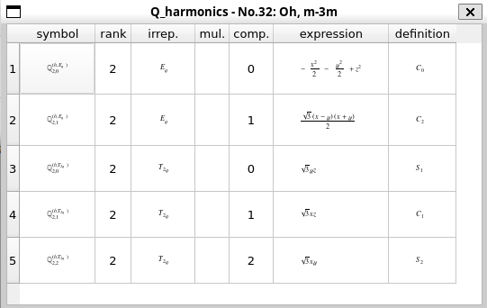

# 結晶場状態（スピン軌道相互作用なし）

球対称性を持つ原子波動関数は$(2l+1)$重に縮退している（$l$は角運動量）が、結晶中では対称性が低下してその縮退が解ける。
この分裂したエネルギー準位（結晶場状態）は点群の既約表現によって分類できる。
どのような既約表現で表されるか、具体例を見ながら確認する。

## 例1：点群$D_{4h}$の下でのp電子

まずは、$p$軌道（角運動量$l=1$）が正方晶の結晶場中でどのように表現されるか確認する。

QtDrawから「MultiPie」を起動する。
表示されるウィンドウの上部のボタンを使う。

- まずは点群を選ぶ。この例では、1「point group」、2「tetragonal」、3「D4h」の順に選択する
- 電子の電荷分布を知りたいので、4「Q」を選択し、rankの部分に角運動量を入れる。いまはp軌道なので5「1」を選択。
- 最後に6「harmonics」ボタンを押す。

このようなウィンドウが表示される。

表の「irrep.」列を見ると、上から$A_{2u}$, $E_u$, $E_u$なので、3重縮退のp軌道は$A_{2u} \oplus E_u$に分裂することがわかる。
「expression」欄に対称性の表現が書かれており、$A_{2u}$は$z$対称性、$E_u$は$\{x, y\}$である。つまり、$p_z$軌道と$\{p_x, p_y\}$軌道に分裂することを意味する。

メインウィンドウには既約表現の軌道の図が描かれる。

各軌道の番号は、表の再左列の番号と対応している。この番号は、「list」ボタン→「orbital」タブ→「ON」にチェックを入れることで表示される（デフォルトはオフ）。

## 例2：点群$O_h$の下でのd電子

次の例として、d電子（角運動量2）の5重縮退が立方対称群$O_h$の結晶場により、2重縮退の$e_g$軌道と3重縮退の$t_{2g}$軌道に分裂することを確認する。
手順は例1と同じなので、結果のみ示す。

番号1, 2がそれぞれ$3z^2-r^2$, $x^2-y^2$の対称性を持つ2重縮退の$e_g$軌道になっている（係数は規格化によって決まっている）。
番号3～5は$yz$, $xz$, $xy$軌道で、3重縮退の$t_{2g}$軌道である。

量子力学の教科書でよく見る軌道が描かれている。

なお、例1から続けて図示した場合には、p軌道の図も同時に表示されている。「list」→「orbital」から表示する軌道を選択するとよい。

## 例3：点群$O_h$の下での$J=4$多重項

最後に少し複雑な例を紹介する。
$4f^2$電子配置では、フント則により全スピン$S=1$、全軌道角運動量$L=5$、全角運動量$J=4$の9重縮退状態が安定となる。この縮退が結晶場によりどのように分裂するかを調べる。
rankに「4」を入れる以外はこれまでの例と変わらないので、結果のみを示す。

$J=4$の9重縮退は、$A_{1g} \oplus E_{g} \oplus T_{1g} \oplus T_{2g}$のように、1重項、2重項、3重項、3重項に分裂することがわかる。
ベーテ表記で表すと、$\Gamma_{1} \oplus \Gamma_{2} \oplus \Gamma_{4} \oplus \Gamma_{5}$である。

**注意**
対称性の議論だけからだと波動関数を決めることはできない。波動関数を決めるには、$A_{1g}$対称性に属する多極子演算子の線形結合によってハミルトニアンを作り、それを対角化すればよい。これにはMultiPieライブラリを使う必要がある。

### 演習問題

- 【何か教育的な例があれば。】
